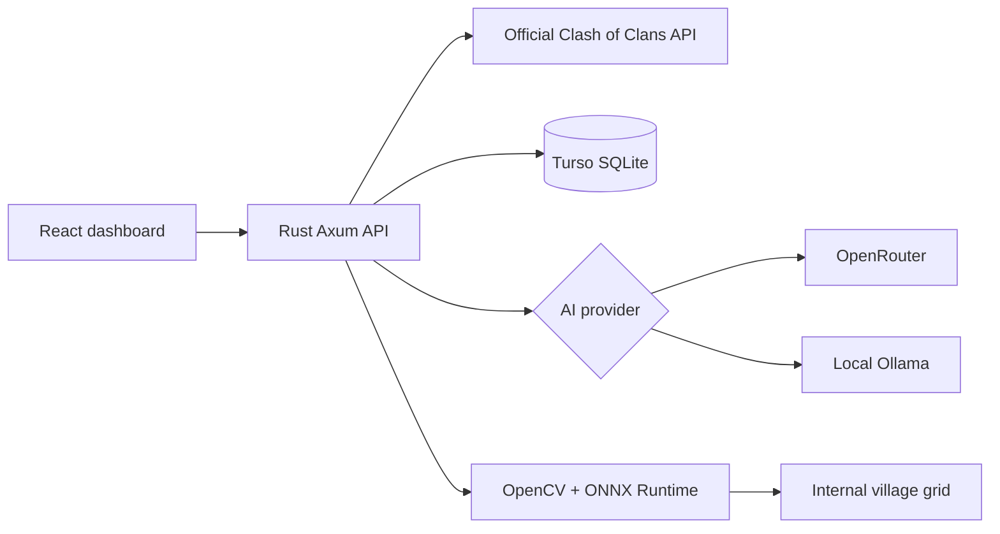

# Architecture

ClashAI uses clean architecture:

- Presentation: React views and Axum routes.
- Application: upgrade ranking, clan aggregation, progress workflows, AI orchestration.
- Domain: player, clan, upgrade, screenshot, and recommendation models.
- Infrastructure: Clash API, Turso, GitHub OAuth, OpenRouter, Ollama, OpenCV, ONNX Runtime.

Legal boundary: ClashAI never controls, scrapes, or instruments the Clash of Clans client.
